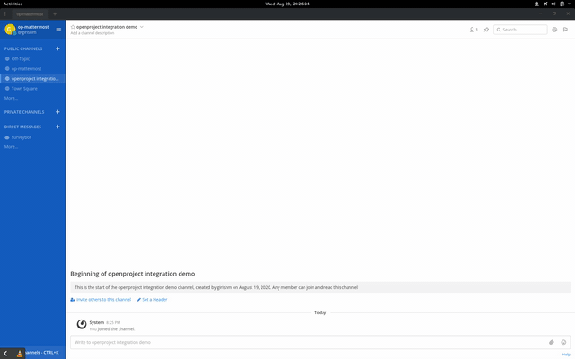

# op-mattermost                                             

[OpenProject](https://www.openproject.org/) integration for [Mattermost](https://mattermost.com/). Currently, supports following operations using a slash command -
- Create time entry for a work package
- Create work package for a project
- View time logs

## Dependencies

- OpenProject community edition
- Mattermost preview
- docker
- Node js and [npm modules](package.json)

## Installing dependencies

- Docker
  - [Download and install](https://docs.docker.com/install/) instructions
- OpenProject
  - Quick install
    - `docker run -it -p 8080:80 -e SECRET_KEY_BASE=secret openproject/community:11` or
  - Recommended install
    - `sudo mkdir -p /var/lib/openproject/{pgdata, static}`
    - `docker run -d -p 8080:80 --name openproject -e SECRET_KEY_BASE=secret 
       -v /var/lib/openproject/pgdata:/var/openproject/pgdata 
       -v /var/lib/openproject/static:/var/openproject/assets
       openproject/community:11`
    - `docker stop openproject`
    - `docker start openproject`
  - For up to date info on OpenProject installation refer their [official docs](https://docs.openproject.org/installation-and-operations/installation/docker).
- Mattermost
  - `docker run --name mattermost-preview -d --publish 8065:8065 --add-host dockerhost:127.0.0.1 mattermost/mattermost-preview`
- Node js
  - [Download and install](https://nodejs.org/en/download/)
  - Run `npm install` to install npm dependencies

## Setup

- Fork and `git clone` the repo using HTTPS
- Install and launch all the dependencies as mentioned above and open the cloned directory in an editor or IDE of your choice
- Run `sh configure.sh` to create `.env` using bash command line. Alternatively, create a `.env` file using a text editor with the following entries:
    - `OP_URL=http://<your host or ip address>:8080/api/v3/   #needed for pointing to OpenProject installation`
    - `INT_URL=http://<your host or ip address>:3000/         #needed for exposing the integration running on port 3000`
    - `MM_URL=http://<your host or ip address>:8065/api/v4/   #needed for pointing to Mattermost installation`  
    - `MATTERMOST_ACCESS_TOKEN=<personal access token>        #https://docs.mattermost.com/developer/personal-access-tokens.html`
    - `MATTERMOST_SLASH_TOKEN=<use the mattermost slash command token for logtime>  #needed for slash command validation`
    - `OP_ACCESS_TOKEN=<openproject access token (a.k.a apikey) obtained from user account page>`
- In the project root directory do `npm init` to generate (or update existing) `package.json` file
- Then run `npm install` to download and install the node modules from npm
- Run op-mattermost in the console using `npm start` (usually launches on port 3000)
- Create a custom Mattermost slash command `/op` as described [here](https://docs.mattermost.com/developer/slash-commands.html) and provide localhost or IP address (with port 3000) as the request URL
- In OpenProject, create a custom field `billable hours` for all work packages in a project
- Test the integration by trying `/op` in the message bar.

## Wiki

Development wiki is available [here](https://notabug.org/girishm/op-mattermost/wiki). It contains the workflows, file description and miscellaneous information necessary for development.

## Demo

 recorded using [vlc](https://www.videolan.org/vlc) and converted to GIF using [ffmpeg](https://ffmpeg.org)

## COPYING

Copyright (C) 2020, 2019 Girish M

This program is free software: you can redistribute it and/or modify
it under the terms of the GNU General Public License as published by
the Free Software Foundation, either version 3 of the License, or
(at your option) any later version.

This program is distributed in the hope that it will be useful,
but WITHOUT ANY WARRANTY; without even the implied warranty of
MERCHANTABILITY or FITNESS FOR A PARTICULAR PURPOSE.  See the
GNU General Public License for more details.

You should have received a copy of the GNU General Public License
along with this program.  If not, see <https://www.gnu.org/licenses/>.
