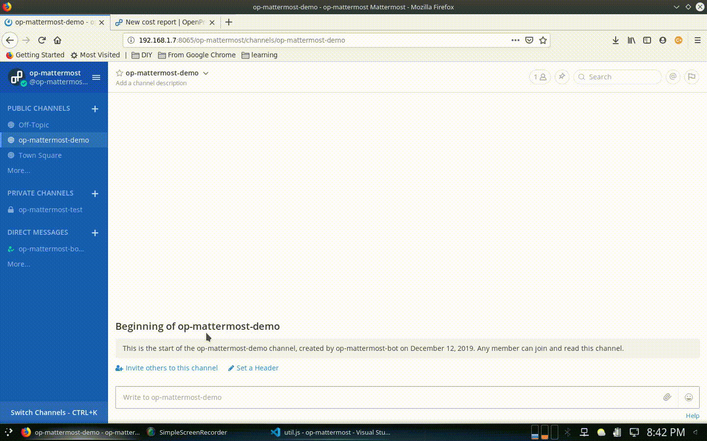

# op-mattermost 

[OpenProject](https://www.openproject.org/) and [Mattermost](https://mattermost.com/) integration to log time for a work package. This integration is built along the lines of [op-slack-connector](https://github.com/girish17/op-slack-connector)

## Dependencies

- OpenProject community edition
- Mattermost preview
- ngrok
- docker
- Node js and [npm modules](package.json)

## Installing dependencies

- Docker
  - [Download and install](https://docs.docker.com/install/) instructions
- OpenProject
  - Quick install
    - `docker run -it -p 8080:80 -e SECRET_KEY_BASE=secret openproject/community:latest` or
  - Recommended install
    - `sudo mkdir -p /var/lib/openproject/{pgdata, static}`
    - `docker run -d -p 8080:80 --name openproject -e SECRET_KEY_BASE=secret 
       -v /var/lib/openproject/pgdata:/var/openproject/pgdata 
       -v /var/lib/openproject/static:/var/openproject/assets 
       openproject/community:latest`
    - `docker stop openproject`
    - `docker start openproject`
- Mattermost
  - `docker run --name mattermost-preview -d --publish 8065:8065 --add-host dockerhost:127.0.0.1 mattermost/mattermost-preview`
- ngrok
  - [Download and install](https://ngrok.com/download)
  - Run `./ngrok http 3000`
- Node js
  - [Download and install](https://nodejs.org/en/download/)
  - Run `npm install` to install npm dependencies

## Setup

- Same as described [here](https://github.com/girish17/op-slack-connector#setup-and-contribution-guidelines).
  - Except for step 3 which invovles creation of `.env` file. Run `sh configure.sh` to create `.env` using command line. The entries in `.env` would contain following:
    - `OP_URL=http://<your host or ip address>:8080/api/v3/    #needed for pointing to OpenProject installation`
    - `INT_URL=<ngrok url>/                                   #needed for exposing the integration running on port 3000`
    - `MM_URL=http://<your host or ip address>:8065/api/v4/    #needed for pointing to Mattermost installation`  
    - `MATTERMOST_ACCESS_TOKEN=<personal access token>        # https://docs.mattermost.com/developer/personal-access-tokens.html`
    - `MATTERMOST_SLASH_TOKEN=<use the mattermost slash command token>  #needed for slash command validation`
    - `OP_ACCESS_TOKEN=<openproject access token obtained from profile page>`
  - Step 7 shall be replaced with creation of Mattermost slash command as described [here](https://docs.mattermost.com/developer/slash-commands.html)

## Demo

## Licence

Copyright (C) 2020, Girish M
This is free and unencumbered software released into the public domain.

Anyone is free to copy, modify, publish, use, compile, sell, or
distribute this software, either in source code form or as a compiled
binary, for any purpose, commercial or non-commercial, and by any
means.

In jurisdictions that recognize copyright laws, the author or authors
of this software dedicate any and all copyright interest in the
software to the public domain. We make this dedication for the benefit
of the public at large and to the detriment of our heirs and
successors. We intend this dedication to be an overt act of
relinquishment in perpetuity of all present and future rights to this
software under copyright law.

THE SOFTWARE IS PROVIDED "AS IS", WITHOUT WARRANTY OF ANY KIND,
EXPRESS OR IMPLIED, INCLUDING BUT NOT LIMITED TO THE WARRANTIES OF
MERCHANTABILITY, FITNESS FOR A PARTICULAR PURPOSE AND NONINFRINGEMENT.
IN NO EVENT SHALL THE AUTHORS BE LIABLE FOR ANY CLAIM, DAMAGES OR
OTHER LIABILITY, WHETHER IN AN ACTION OF CONTRACT, TORT OR OTHERWISE,
ARISING FROM, OUT OF OR IN CONNECTION WITH THE SOFTWARE OR THE USE OR
OTHER DEALINGS IN THE SOFTWARE.

For more information, please refer to <https://unlicense.org>
